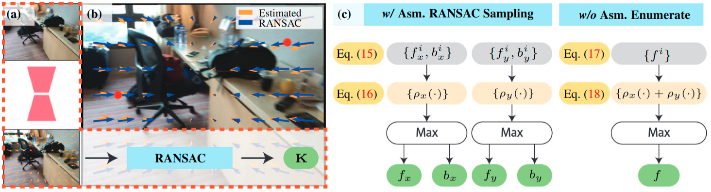
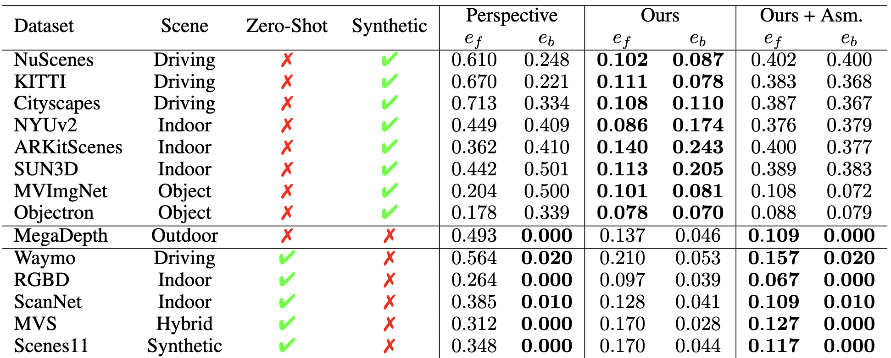
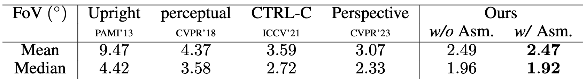
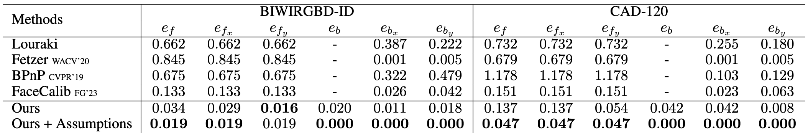

# WildCamera
Code and data for **Tame a Wild Camera: In-the-Wild Monocular Camera Calibration, Zhu et al, Arxiv 2023**

# Applications and Qualitative Results
- 4 DoF Camera Calibration (Zero-Shot)
  

  -  Camera Calibration:

    https://github.com/ShngJZ/WildCamera/assets/128062217/cbc78faf-7128-4850-80f0-fe157b0deb4e

  -  DollyZoom-Demo1:
    
    https://github.com/ShngJZ/WildCamera/assets/128062217/0c25c605-2785-413b-bd54-6067a43c8987

  -  DollyZoom-Demo2:
    
    https://github.com/ShngJZ/WildCamera/assets/128062217/c0709e39-3704-456a-8724-10f87e7555e0

  -  DollyZoom-Demo3:
    
    https://github.com/ShngJZ/WildCamera/assets/128062217/320ab8e7-5808-47d0-ab35-16297e6fb695

- Image Crop and Resize Detection and Restoration (Zero-Shot)
  

  https://github.com/ShngJZ/WildCamera/assets/128062217/c94dcf6d-5378-4a14-9f1c-ee7a966e2d2f
  
- In-the-Wild Monocular 3D Object Detection ([Omni3d](https://github.com/facebookresearch/omni3d))
  

  https://github.com/ShngJZ/WildCamera/assets/128062217/e27961de-0895-4cfe-82ec-387019d2eff0

# Introduction

Our work focuses on monocular camera calibration for in-the-wild images.
We propose to learn the incidence field as a monocular 3D prior.
The incidence field is the collection of the pixel-wise incidence ray, which originates from a 3D point, targets at a 2D pixel, and crosses the camera origin, as shown in (b).
We develop a neural network to learn in-the-wild incidence field and a RANSAC algorithm to recover intrinsic from the estimated incidence field.

# Experiments
- **In-the-Wild Monocular Camera Calibration**

  We benchmark in-the-wild monocular camera calibration performance. 
  Entry ''Synthetic'' randomly generates novel intrinsics with image resizing and cropping.
  Entry ''Ours + Assumption'' assumes 1DoF intrinsic, i.e., assuming central focal point and identical focal length.
  Baseline ''[Perspective](https://github.com/jinlinyi/PerspectiveFields)'' is a recent CVPR'23 work.
  

- **Comparisons to Monocular Camera Calibration with Geometry**\
  

- **Comparisons to Calibration with Object**\
  

# Live Demo
We are wroking on a Hugging Face interface for an online demo.

# Code, Data, and Model
We will release upon publication.

